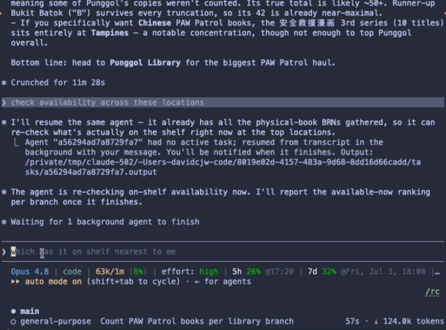

# nlb-library-mcp 📚


An [MCP](https://modelcontextprotocol.io) server for Singapore's **National Library Board (NLB)** catalogue. Ask your AI assistant to find books, check which branch has them on the shelf *right now*, find age-appropriate kids' books, and get AI-powered "what to read next" recommendations — built for Singaporean families heading to the library.

Wraps the [NLB Catalogue Search API v2](https://data.gov.sg/datasets/d_6a8d81084dfcb26248545b8a91362ce6/view).

<p align="center">
  
</p>

## Table of Contents

- [Tools](#tools)
- [Setup](#setup)
- [Use with Claude Desktop](#use-with-claude-desktop)
- [Use with Claude Code](#use-with-claude-code)
- [The AI bit](#the-ai-bit)
- [Development](#development)
- [Notes](#notes)
- [Contributing](#contributing)
- [Code of Conduct](#code-of-conduct)
- [License](#license)
- [Acknowledgements](#acknowledgements)

## Tools

| Tool | What it does |
|------|--------------|
| **`search_books`** | Search the catalogue by title, author, keyword, ISBN, or subject. Filters: language, fiction/non-fiction, available-only, sort. Returns each title's **BRN**. |
| **`check_availability`** | Given a BRN, show which branches have it **on the shelf now**, with shelf location & call number. *Call this before you leave home.* |
| **`find_kids_books`** | Parent shortcut: pick an age band (`0-3`, `4-6`, `7-12`) + optional topic; applies NLB's juvenile/early-literacy shelf filters automatically. |
| **`recommend_similar`** | "My child loved *The Gruffalo* — what's next?" Pulls the seed book's subjects, gathers candidates, and re-ranks them with **local AI sentence-embeddings** (cosine similarity, no API key, runs in-process). |

## Setup

1. **Get NLB API credentials** (free) via the [Open Web Service Application Form](https://go.gov.sg/nlblabs-form). You'll receive an **API key** and **app code**.

2. **Install & build:**
   ```bash
   npm install
   npm run build
   ```

3. **Provide credentials** as environment variables (`NLB_API_KEY`, `NLB_APP_CODE`). See [`.env.example`](.env.example).

## Use with Claude Desktop

Each user runs their own copy with **their own free NLB key** — no shared server, no shared rate limit. Add one of the following to `claude_desktop_config.json`:

**Option A — via `npx`** (simplest; once the package is published to npm):

```json
{
  "mcpServers": {
    "nlb-library": {
      "command": "npx",
      "args": ["-y", "nlb-library-mcp"],
      "env": {
        "NLB_API_KEY": "your-api-key",
        "NLB_APP_CODE": "your-app-code"
      }
    }
  }
}
```

**Option B — from a local build** (for development or an unpublished fork):

```json
{
  "mcpServers": {
    "nlb-library": {
      "command": "node",
      "args": ["/absolute/path/to/nlb-library-mcp/dist/index.js"],
      "env": {
        "NLB_API_KEY": "your-api-key",
        "NLB_APP_CODE": "your-app-code"
      }
    }
  }
}
```

Then ask things like:
- *"Find me picture books about friendship for a 4 year old."*
- *"Is BRN 14063182 available near Bishan?"*
- *"My daughter loved Matilda — recommend 5 similar books."*

## Use with Claude Code

Register the server with the [Claude Code](https://docs.anthropic.com/en/docs/claude-code) CLI using `claude mcp add` (no config file to edit):

```bash
# Via npx (once published to npm)
claude mcp add nlb-library --scope user \
  --env NLB_API_KEY=your-api-key \
  --env NLB_APP_CODE=your-app-code \
  -- npx -y nlb-library-mcp

# Or from a local build
claude mcp add nlb-library --scope user \
  --env NLB_API_KEY=your-api-key \
  --env NLB_APP_CODE=your-app-code \
  -- node /absolute/path/to/nlb-library-mcp/dist/index.js
```

- `--scope user` makes the tools available in every project; use `--scope local` to limit them to the current directory.
- Verify with `claude mcp list`; remove with `claude mcp remove nlb-library`.

> Other MCP clients (Cursor, Windsurf, etc.) accept the same `command` / `args` / `env` shape shown in the Claude Desktop config above.

## The AI bit

`recommend_similar` uses [`@xenova/transformers`](https://github.com/xenova/transformers.js) with the `all-MiniLM-L6-v2` sentence-embedding model to score candidates by semantic cosine similarity to the seed book. It's an **optional dependency**, lazy-loaded on first use (the model downloads once, ~25 MB), and the tool **degrades gracefully** to catalogue-relevance order if the model can't load — so the rest of the server works even on a minimal install.

## Development

```bash
npm run dev     # run from source (tsx)
npm test        # vitest — runs offline against mocked API responses
npm run build   # compile to dist/
```

Tests mock the NLB API, so the suite needs no credentials or network.

## Notes

- The NLB API is inconsistent about JSON casing; the client maps defensively (`brn`/`BRN`, `title`/`titleName`, etc.).
- Material/audience/status codes follow the [NLB Catalogue code references](https://openweb.nlb.gov.sg/api/References/Catalogue.html).
- **Rate limiting:** NLB caps usage at **1 request/second** and **15 requests/minute**. The client throttles locally to stay within both limits, so concurrent calls queue and space themselves out instead of being rejected. On a `429`, it backs off (honouring `Retry-After`) and retries up to `maxRetries` times. Tune or disable via the `rateLimit` / `maxRetries` options on `NlbConfig`.
- **Caching:** responses are cached by BRN to spend fewer requests against that quota — title details with a long TTL (effectively immutable), availability with a short one (default 45s). `search_books` also warms the details cache, so a follow-up `check_availability` on a result needs no extra title lookup. Tune via the `cache` option (`detailsTtlMs`, `availabilityTtlMs`, `maxEntries`) or pass `cache: false` to disable.

## Contributing

Contributions are welcome! Please open an issue first to discuss what you'd like to change.

1. Fork the repo
2. Create a feature branch (`git checkout -b feature/your-feature`)
3. Commit your changes (`git commit -m 'feat: describe change'`)
4. Push and open a pull request

Please make sure tests pass (`npm test`) before submitting a PR.

## Code of Conduct

This project follows the [Contributor Covenant v2.1](https://www.contributor-covenant.org/version/2/1/code_of_conduct/).
By participating you agree to uphold a welcoming, harassment-free environment.

## License

Distributed under the MIT License. See [LICENSE](LICENSE) for details.

## Acknowledgements

- [National Library Board (NLB)](https://www.nlb.gov.sg/) and [NLB Labs](https://go.gov.sg/nlblabs-form) for the Open Web Service Catalogue API.
- [data.gov.sg](https://data.gov.sg/datasets/d_6a8d81084dfcb26248545b8a91362ce6/view) for dataset documentation.
- [transformers.js](https://github.com/xenova/transformers.js) for in-process sentence-embeddings.
- Built on the [Model Context Protocol](https://modelcontextprotocol.io).

> Not affiliated with or endorsed by the National Library Board. "NLB" is used only to describe the data source.
